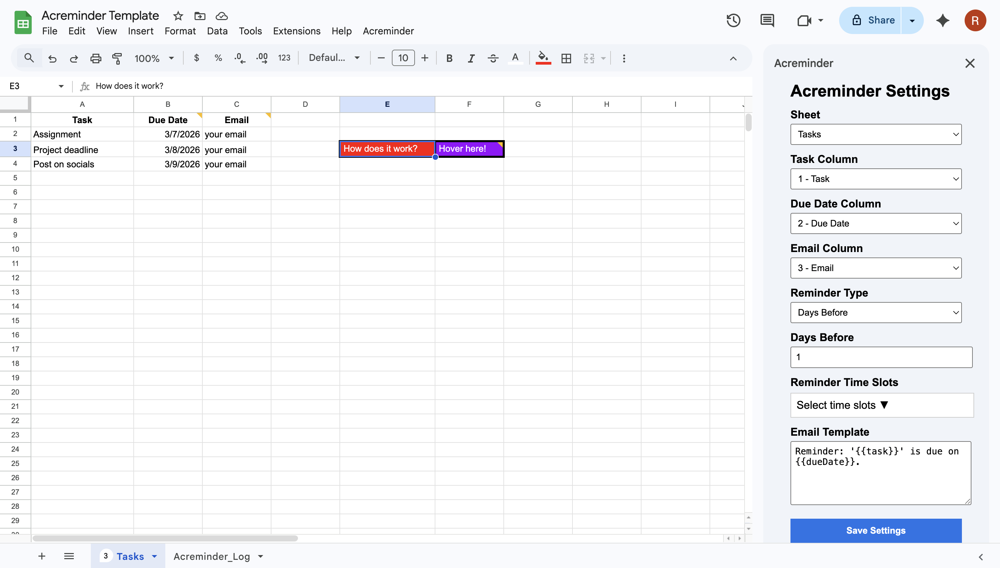
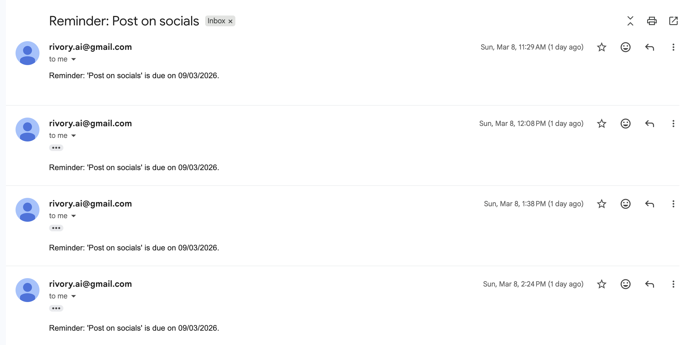

# Acreminder - Google Sheets Email Reminder Tool

Acreminder is a lightweight Google Sheets automation that sends reminder emails based on due dates in your spreadsheet.

Built using Google Apps Script.

## Features

• Automatic reminder emails  
• Custom message templates  
• Sidebar configuration  
• Works with any Gmail account  
• Runs on scheduled triggers  
• No external tools required  

## Setup

1. Make a copy of the template sheet  
2. Open Extensions → Apps Script  
3. Authorize once  
4. Open Acreminder → Settings  
5. Done  

## Screenshots

### Example Sheet  

### Email Example  

